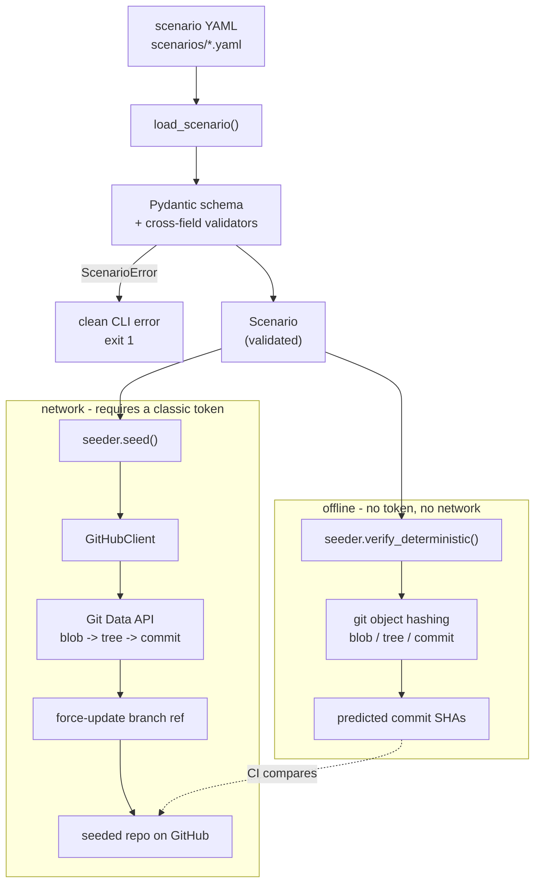

# agenteval

[](https://github.com/MonaRahmani/agenteval/actions/workflows/ci.yml)

A Python CLI harness that seeds reproducible GitHub test environments for evaluating AI coding agents.

## What it does

`agenteval` takes a scenario file — a declarative description of a repository and its
commit history — and materialises it as a real GitHub repository. The history is
synthetic and deliberate: it starts as working code and acquires a specific, documented
bug at a specific commit, so an agent can be asked to find and fix it.

The same scenario always produces the same repository, down to the commit SHAs. Seed it
today and seed it again next month and you get byte-identical history.

## Why determinism matters

Evaluating a coding agent means comparing runs — this model against that one, this prompt
against the last, today's build against last week's. If the test environment differs
between runs, the comparison measures the environment as much as the agent, and any
difference in score is unattributable.

A git commit's SHA hashes its tree, its parents, its message, **and both of its
timestamps** — author date and committer date are separate fields. The usual way to build
a repository programmatically leaves the committer date defaulting to the current time,
which means every run produces different SHAs even when every file is identical. Two
"identical" test environments then differ in every commit hash, and anything keyed on
those hashes diverges.

`agenteval` takes both dates from the scenario file and never calls `now()`:

```python
identity = InputGitAuthor(author_name, author_email, timestamp)
commit = repo.create_git_commit(
    message=message,
    tree=tree,
    parents=parents,
    author=identity,
    committer=identity,  # the same pinned timestamp for both
)
```

This is verified rather than asserted. `verify_deterministic()` recomputes the expected
SHAs offline using git's own object hashing — no token, no network — and the test suite
checks those predictions against the real `git` binary by building the same history with
`git commit-tree` and comparing `git rev-parse HEAD`. CI then runs a dedicated
`determinism` job on every push that recomputes every scenario's SHAs three times: twice
in-process and once in a fresh interpreter under a different `PYTHONHASHSEED`, so a
dependency on dict iteration order cannot hide. Divergence fails the build with the
differing SHAs printed.

## Architecture



The offline path is not a simulation of the online one — it is an independent
implementation of git's hashing rules, which is what makes it useful as a check.

## Quickstart

```bash
git clone https://github.com/MonaRahmani/agenteval.git
cd agenteval
python3.12 -m venv .venv && source .venv/bin/activate
pip install -e '.[dev]'
```

Validate a scenario. This needs no token and makes no network calls:

```console
$ agenteval validate scenarios/failing-import.yaml
OK  scenarios/failing-import.yaml
  name       : failing-import
  rubric     : rubrics/failing-import.yaml
  files      : 6
  commits    : 4

  expected commits (computed offline):
    6b7b45e2f1  2026-01-05  4 changed / 4 total  Add inventory package with Item model and Store
    446cc36cfa  2026-01-06  1 changed / 5 total  Add tests covering Store totals and duplicate SKUs
    7abd477d0d  2026-01-08  2 changed / 6 total  Add report module for formatted stock listings
    44149d5c14  2026-01-12  1 changed / 6 total  Reuse report.format_currency in Item.summary
```

Preview a seed. Also needs no token, because a dry run writes nothing:

```console
$ agenteval seed scenarios/failing-import.yaml --dry-run
[dry-run] no GITHUB_TOKEN set; running unauthenticated - no API calls will be made
dry run: no writes will be made
[dry-run] would create repo 'failing-import' with topic 'agenteval-managed'
commit 1/4 6b7b45e Add inventory package with Item model and Store
...
```

The SHAs a dry run reports are the ones a live seed will actually produce — the same
values `validate` predicts, computed the same way. A preview that disagreed with the
result would defeat the purpose.

Seed for real, then clean up:

```bash
export GITHUB_TOKEN=ghp_...          # classic token, see below
agenteval seed scenarios/failing-import.yaml
agenteval reset failing-import       # prompts; pass --yes to skip
```

`reset` refuses to delete any repository that is not tagged with the
`agenteval-managed` topic, so a name collision with real work cannot destroy it.

## Token setup

A **classic** personal access token is required, with exactly two scopes:

| Scope         | Needed for                  |
| ------------- | --------------------------- |
| `repo`        | creating and writing repos  |
| `delete_repo` | `agenteval reset`           |

Grant nothing beyond those two.

Fine-grained personal access tokens **do not work**. They cannot create repositories
under a personal account, which is a GitHub limitation and not something this tool can
work around. Attempting it fails with:

```
403 Resource not accessible by personal access token
```

`agenteval` detects that specific failure and says so, rather than leaving you to guess.

Create a classic token at **Settings → Developer settings → Personal access tokens →
Tokens (classic)**. If you only want to explore the tool, `validate` and `seed --dry-run`
need no token at all.

## Scenario format

A scenario declares a path manifest and a list of commits. Each commit carries the **full
content of the files it touches, as of that commit**:

```yaml
name: failing-import              # must be a valid GitHub repo name
description: A package that acquires a circular import partway through its history.
seeded_bug: >-                    # what the agent is expected to find
  Commit 3 adds report.py importing models.py. Commit 4 then makes models.py
  import report.py at module scope, closing the cycle.
rubric: rubrics/failing-import.yaml

files:                            # manifest: every path the repo may contain
  - path: inventory/models.py
    description: The Item dataclass. Rewritten by the final commit to introduce the cycle.
  - path: inventory/report.py
    description: Currency formatting. Imports models, which later imports it back.

commits:
  - message: "Add inventory package with Item model and Store"
    author_date: 2026-01-05T09:14:00Z     # required; determinism depends on it
    files:
      - path: inventory/models.py
        content: |
          from dataclasses import dataclass
          # working version - formats currency inline, imports nothing

  - message: "Add report module for formatted stock listings"
    author_date: 2026-01-08T11:37:00Z
    files:
      - path: inventory/report.py
        content: |
          from inventory.models import Item
          # report -> models. Fine on its own; nothing imports report yet.

  - message: "Reuse report.format_currency in Item.summary"
    author_date: 2026-01-12T16:55:00Z
    files:
      - path: inventory/models.py         # same path as commit 0, new content
        content: |
          from inventory.report import format_currency
          # models -> report closes the cycle. The bug arrives here.
```

Content is declared **per commit, not once globally**. That is what makes progressive
history possible: `inventory/models.py` appears in commit 0 as working code and again in
commit 3 with the bug, so the repository has a genuine before and after rather than a
history where every commit already contains the final state.

The schema enforces the rules that make a scenario seedable and reproducible:

- Every path a commit touches must appear in the manifest, and every manifest path must be
  touched by at least one commit.
- `author_date` is required and must strictly ascend across commits.
- Rewriting a file with content identical to its previous version is an error — that is a
  no-op commit.
- Paths must be relative, with no `..` and no absolute paths.

Each commit is seeded with the **cumulative** tree at that point, not just the files it
touches, so a file written at commit 0 and untouched afterwards remains present.

## Design decisions

**Git Data API, not the Contents API.** The Contents API writes one file per commit and
generates the commit metadata itself. The Git Data API builds objects explicitly — blob,
then tree, then commit, then ref — which allows a multi-file commit as a single atomic
tree, and, critically, allows setting author and committer dates explicitly. Determinism
is impossible without that second property.

**Repos are created with `auto_init=True` and the branch ref is force-updated
afterwards.** The Git Data API refuses to create blobs in a repository with zero commits
(`409 Git Repository is empty`), so the repo must have an initial commit before anything
can be written. That auto-init commit must not appear in the seeded history, so the first
scenario commit is written as a root commit with no parent and the branch is force-moved
onto the final scenario commit at the end, orphaning it. This was found by live testing;
the mocked test suite passed throughout, because a mock has no opinion about whether a
repository is empty.

**Validation lives in the schema, not the seeder.** Every rule — ascending dates, no
undeclared paths, no no-op rewrites — is a Pydantic validator on the scenario model. A
`Scenario` object that exists is therefore already seedable, so the seeder contains no
defensive checks and determinism becomes a property of the data rather than a behaviour of
the code. It also means `agenteval validate` can catch a broken scenario in CI, offline,
before anyone spends an API call on it.

**Dev tooling versions are pinned exactly.** `ruff`, `mypy`, `pytest` and `pytest-cov` are
pinned with `==` rather than `>=`. An unpinned formatter let CI install a newer `ruff`
than the local environment had, producing a formatting failure that could not be
reproduced on the machine that had to fix it. Pinning makes local and CI agree by
construction; bumps are deliberate and reviewable.

## Development

```bash
pytest                                              # 167 tests
pytest --cov=agenteval --cov-fail-under=85          # coverage floor is 85%
ruff check .                                        # lint
ruff format --check .                               # formatting
mypy src                                            # strict type checking
```

CI runs all of the above across Python 3.11 and 3.12, plus two dedicated jobs: one that
verifies determinism across repeated runs, and one that validates every scenario in
`scenarios/` against the schema so a drifting example fails the build. No job requires a
token or network access — the whole pipeline passes with no secrets configured.

Tests that cross-check against the real `git` binary skip cleanly when `git` is absent.

## Project status

Implemented:

- Scenario schema with cross-field validation (`src/agenteval/scenario.py`)
- GitHub client over the Git Data API, with a marker-based deletion guard
  (`src/agenteval/github_client.py`)
- Seeder with offline SHA verification (`src/agenteval/seeder.py`)
- CLI: `validate`, `seed`, `reset`, `version` (`src/agenteval/cli.py`)
- CI: lint, format, typecheck, tests, determinism, scenario validation

Planned, not yet built:

- Rubric scoring engine. `rubrics/` and the scenario `rubric` field are placeholders; the
  rubric file format is not defined yet and nothing reads it.
- Webhook receiver for observing agent activity against a seeded repo.
- MCP server exposing scenarios to agents directly.

Only one scenario ships today (`scenarios/failing-import.yaml`).
